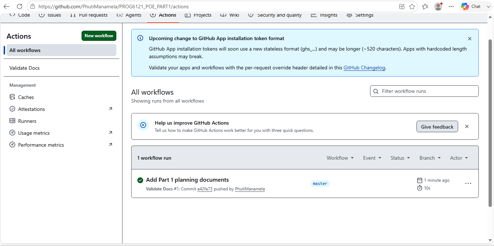

RaceDay

System Description

RaceDay is a full-stack, web-based event management system for South Africa's road running, walking, and cycling community. It replaces paper-based registration, spreadsheets, and disconnected communication with a single platform where Event Organisers can create and manage events and categories and capture participant results, while Participants can browse events, enter events under a category, view their own enrolments, and track their personal race results.

This repository covers **Part 1** of the Portfolio of Evidence: system architecture and database planning. No API or application code is included in this part — only the ERD, API endpoint plan, and SQL database script found in [`/docs`](./docs).

## User Roles

- **Organiser** — Can create, edit, and delete events; manage event categories; capture/record participant results; and view all participant enrolments.
- **Participant** — Can register/login; browse events and categories; enter/enrol in events under a category; view their own enrolments; and track their personal race results.

## Part 1 Planning Documents (`/docs`)

- [`ERD.png`](./docs/ERD.png) — Entity Relationship Diagram (6 entities: Role, User, Event, Category, Enrolment, Result) with primary keys, foreign keys, and cardinalities.
- [`endpoints.md`](./docs/endpoints.md) — Full API endpoint specification plan covering authentication, user profile, events, categories, enrolments, and results.
- [`schema.sql`](./docs/schema.sql) — SQL Server script that creates all tables with constraints and seeds realistic sample data (organisers, participants, events, categories, enrolments, and results).

## CI/CD

A GitHub Actions workflow at [`.github/workflows/validate-docs.yml`](./.github/workflows/validate-docs.yml) runs on every push and confirms the `/docs` folder exists and contains the required ERD, endpoint plan, and SQL script.

**Build status:**

*(Screenshot above shows the green passing build — replace `ci-success.png` with your own screenshot from the Actions tab.)*

## Video Presentation

Unlisted YouTube walkthrough of the planning documents, ERD decisions, endpoint plan choices, and a live run of the SQL script in SSMS:

**[Watch here] (https://youtu.be/pel2TtPONrU?si=vZKNJygwRrMd79dU)** 

## AI Disclosure

Parts of the Part 1 planning documents (ERD structure, endpoint specification table, and SQL script drafting) were produced with the assistance of an AI tool (Claude, Anthropic) and reviewed, understood, and adapted by the author. No AI-generated voiceover was used in the video presentation.
